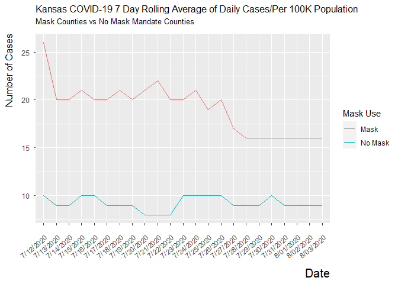

Lab 07 - Conveying the right message through visualisation
================
Adam Paul
5-06-22

### Load packages and data

``` r
library(tidyverse) 
```

Okay, I wouldn’t say that graph is misleading so much as outright
deceptive. The use of widly different scales completely obfuscates the
actual relationship between the two variables.

### Exercise 1

> Create a data frame that can be used to re-construct this
> visualization. You may need to guess some of the numbers, that’s ok.
> You should first think about how many rows and columns you’ll need and
> what you want to call your variables. Then, you can use the tribble()
> function for this. For example, if you wanted to construct the
> following data frame

``` r
df <- tribble(
  ~date, ~mask, ~no_mask,
  "7/12/2020", 26, 10,
  "7/13/2020", 20, 9,
  "7/14/2020", 20, 9,
  "7/15/2020", 21, 10,
  "7/16/2020", 20, 10,
  "7/17/2020", 20, 9,
  "7/18/2020", 21, 9,
  "7/19/2020", 20, 9,
  "7/20/2020", 21, 8,
  "7/21/2020", 22, 8,
  "7/22/2020", 20, 8,
  "7/23/2020", 20, 10,
  "7/24/2020", 21, 10,
  "7/25/2020", 19, 10,
  "7/26/2020", 20, 10,
  "7/27/2020", 17, 9,
  "7/28/2020", 16, 9,
  "7/29/2020", 16, 9,
  "7/30/2020", 16, 10,
  "7/31/2020", 16, 9,
  "8/01/2020", 16, 9,
  "8/02/2020", 16, 9,
  "8/03/2020", 16, 9,
)
```

### Exercise 2

> Make a visualization that more accurately (and honestly) tells the
> story.

I remembered from the last lab and from my suffering during making
graphs for my portfolio projects that ggplot plays way, way nicer with
long data. So we’re doing that now, by combining mask and no\_mask into
a single condition.

``` r
df_long <- df %>%
  pivot_longer(cols= !date, names_to="mask", values_to="cases") 

view(df_long)

df_long$cases = as.numeric(df_long$cases)
```

``` r
df_long %>%
  ggplot(aes(x=date, y=cases, group=mask, color=mask)) +
  geom_line() +
    theme(axis.text.x = element_text(angle = 40, vjust=1, hjust=1)) +
  labs(title = "Kansas COVID-19 7 Day Rolling Average of Daily Cases/Per 100K Population",
      subtitle = "Mask Counties vs No Mask Mandate Counties", 
      x = "Date", y = "Number of Cases", 
      color = "Mask Use") +
  scale_color_discrete(labels=c("Mask","No Mask")) +
    theme( #trbl are the margin signs, top, right, bottom, left
    plot.title = element_text(size = 12, margin = margin(b = 5)),
    plot.subtitle = element_text(size = 10, margin = margin(b= 10)),
    axis.title = element_text(size = 12, hjust = 1),    
    axis.title.x = element_text(size= 15, margin = margin(t = 10)),
    axis.title.y = element_text(margin = margin(t= 30, r = 10)),
    axis.text.y = element_text(margin = margin(r = 5)),
    axis.text.x = element_text(margin = margin(t = 10)),
  ) 
```

<!-- -->

### Exercise 3

> What message is more clear in your visualization than it was in the
> original visualization?

The truth is that there are substantially less cases in counties without
mask mandates than in counties with mask mandates. However, cases
steadily fell in counties that had mask mandates over time, while no
mandates stayed around the same.

### Exercise 4

> What, if any, useful information do these data and your visualization
> tell us about mask wearing and COVID? It’ll be difficult to set aside
> what you already know about mask wearing, but you should try to focus
> only on what this visualization tells. Feel free to also comment on
> whether that lines up with what you know about mask wearing.

This actually doesn’t conflict with what I know about Covid-19, and more
importantly, the Seasonal Affective Disorder made manifest state of
Kansas. The population of Kansas is extremely concentrated in several
cities, and much of the land stretches on for miles between neighbors.
The counties that have mask mandates are probably more populous, and
therefore have a lot more contact between individuals. Of course, the
graph fails to distinguish by county population, so we can’t answer
whether my expectation about Kansas is true.
